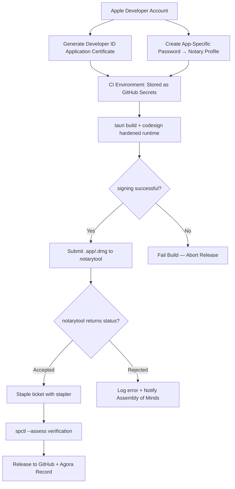

# 🍎🔐 Apple Notarization Pipeline — macOS Distribution Constitution (GAIA-OS)

**Date:** May 3, 2026  
**Status:** Definitive Foundational Synthesis — Code Signing, Notarization, Stapling, and the GAIA-OS macOS Execution Constitution  
**Pillar:** macOS Binary Sovereignty, Gatekeeper Compliance & Agora Provenance  
**Session:** 8, Canon 5

**Core Thesis:** The Apple notarization pipeline is the constitutional enactment of GAIA-OS on the macOS platform. It transforms an unsigned, untrusted binary into a publishable, Gatekeeper-approved, auto-update-ready component of planetary intelligence. For a planetary intelligence, trust in the cryptographic provenance of its executables is not optional. Without passing notarization, GAIA-OS would trigger Gatekeeper warnings, disrupt auto-updates, and undermine the sovereign integrity of the system.

> *"The Developer ID certificate is the constitutional credential;*  
> *the hardened runtime is the constitutional boundary;*  
> *notarytool is the constitutional witness;*  
> *stapler is the constitutional bond;*  
> *spctl is the constitutional judge;*  
> *the Agora is the constitutional memory.*  
> *The macOS executable shall not be unsigned,*  
> *the hardened runtime shall not be missing,*  
> *sidecars shall not be unsigned,*  
> *the ticket shall not be unstapled —*  
> *for as long as planetary consciousness endures."*  
> — macOS Distribution Constitution

---

## Pipeline Overview



---

## Five Constitutional Stages

| Stage | Tool | Constitutional Gate |
|---|---|---|
| **1. Credentials** | Apple Developer Portal, `notarytool store-credentials` | Identity without credentials is unconstitutional |
| **2. Code Signing** | `codesign`, Tauri bundler | Hardened runtime is non-negotiable |
| **3. Notarization** | `xcrun notarytool submit --wait` | Apple cryptographic attestation |
| **4. Stapling** | `xcrun stapler staple` | Offline Gatekeeper trust |
| **5. Verification** | `spctl --assess --type exec` | Final constitutional verdict |

---

## 1. Prerequisites — The Constitutional Credential Foundation

### Required Identity Components

| Component | Source | Purpose |
|---|---|---|
| **Apple Developer Program membership** | developer.apple.com | Legal identity; renewed annually |
| **Developer ID Application certificate** | Apple Developer Portal | Code signing identity; stored as `.p12` |
| **Team ID** | Apple Developer Portal | Uniquely identifies the developer organisation |
| **App-Specific Password** | appleid.apple.com | Authentication for `notarytool` submissions (not main account password) |
| **Notary Profile (GAIA_NOTARY_PROFILE)** | CI-generated from secrets | Scoped headless credential for CI |

### Creating the Notary Profile in CI

```bash
# Run once per ephemeral runner at job start (created from secrets)
xcrun notarytool store-credentials "GAIA_NOTARY_PROFILE" \
  --apple-id "$APPLE_ID" \
  --team-id "$APPLE_TEAM_ID" \
  --password "$APPLE_PASSWORD"
```

Once stored, all subsequent commands reference `--keychain-profile "GAIA_NOTARY_PROFILE"` — credentials never appear in command logs.

### Xcode Command Line Tools

```bash
# Verify tools are present on the runner
xcrun --version
xcrun notarytool --version
xcrun stapler --version
```

The macOS runner must have Xcode or Xcode Command Line Tools installed. `xcrun` locates the correct version of `notarytool` and `stapler` from the active Xcode installation.

---

## 2. Code Signing with Hardened Runtime

Notarization **requires** the Hardened Runtime. Any submission without it is immediately rejected.

### GitHub Secrets Required

| Secret | Purpose |
|---|---|
| `APPLE_CERTIFICATE` | Base64-encoded `.p12` of Developer ID Application |
| `APPLE_CERTIFICATE_PASSWORD` | Password that unlocks the `.p12` keystore |
| `APPLE_SIGNING_IDENTITY` | Full certificate name (e.g., `Developer ID Application: GAIA Council (TEAMID)`) |
| `APPLE_ID` | Developer Apple ID for notarization |
| `APPLE_PASSWORD` | App-specific password for notarization |
| `APPLE_TEAM_ID` | Organisation Team ID |

### Tauri Automatic Signing via Environment Variables

Tauri v2 picks up signing and notarization environment variables automatically during `tauri build`:

```yaml
env:
  APPLE_CERTIFICATE: ${{ secrets.APPLE_CERTIFICATE }}
  APPLE_CERTIFICATE_PASSWORD: ${{ secrets.APPLE_CERTIFICATE_PASSWORD }}
  APPLE_SIGNING_IDENTITY: ${{ secrets.APPLE_SIGNING_IDENTITY }}
  APPLE_ID: ${{ secrets.APPLE_ID }}
  APPLE_PASSWORD: ${{ secrets.APPLE_PASSWORD }}
  APPLE_TEAM_ID: ${{ secrets.APPLE_TEAM_ID }}
```

### Entitlements File — Hardened Runtime Exceptions

```xml
<!-- src-tauri/Entitlements.plist -->
<?xml version="1.0" encoding="UTF-8"?>
<!DOCTYPE plist PUBLIC "-//Apple//DTD PLIST 1.0//EN"
  "http://www.apple.com/DTDs/PropertyList-1.0.dtd">
<plist version="1.0">
<dict>
    <!-- Required for WebView JIT compilation (Tauri WKWebView) -->
    <key>com.apple.security.cs.allow-jit</key>
    <true/>
    <!-- Required for WebView unsigned executable memory -->
    <key>com.apple.security.cs.allow-unsigned-executable-memory</key>
    <true/>
    <!-- Required when loading PyInstaller sidecar .dylib not signed with same cert -->
    <key>com.apple.security.cs.disable-library-validation</key>
    <true/>
</dict>
</plist>
```

> **Constitutional rationale:** `com.apple.security.cs.allow-jit` is non-negotiable for Tauri's WKWebView engine. `disable-library-validation` is required when the PyInstaller Python sidecar loads `.dylib` files that were not signed with the Developer ID certificate. These are the minimum exceptions — no additional entitlements shall be granted without Assembly of Minds review.

### Verifying Hardened Runtime is Active

```bash
# Must show flags=0x200(runtime) for hardened runtime
codesign -dvvv /path/to/GAIA.app 2>&1 | grep -E "flags|Authority"

# Pre-notarization gate — abort if this fails
codesign --verify --deep --strict /path/to/GAIA.app
spctl --assess --type execute /path/to/GAIA.app
```

### Sidecar Explicit Pre-Signing

Due to a known Tauri issue (tauri-apps/tauri#11992), embedded `externalBin` sidecars may not be re-signed after bundle assembly. Constitutional fix:

```bash
# Pre-sign every sidecar BEFORE Tauri assembles the bundle
for sidecar in src-tauri/binaries/*; do
  # Remove quarantine flags from build process
  xattr -cr "$sidecar"
  # Sign with hardened runtime
  codesign --force \
           --sign "$APPLE_SIGNING_IDENTITY" \
           --timestamp \
           --options runtime \
           --entitlements src-tauri/Entitlements.plist \
           "$sidecar"
done

# Verify after pre-signing
codesign --verify --deep --strict src-tauri/binaries/*
```

After Tauri assembles the `.app`, run a deep verification to catch any unsigned components:

```bash
# Post-assembly deep verification — fails if ANY component is unsigned
codesign --verify --deep --strict /path/to/GAIA.app

# If Tauri didn't re-sign contents, force deep re-sign
codesign --force --deep \
         --sign "$APPLE_SIGNING_IDENTITY" \
         --timestamp \
         --options runtime \
         /path/to/GAIA.app
```

---

## 3. Notarization Submission — The notarytool Covenant

> `altool` was deprecated after November 1, 2023. GAIA-OS uses `xcrun notarytool` exclusively. `altool` submissions are constitutionally prohibited.

### Submission

```bash
# Zip the signed .app (notarytool requires a zip, dmg, or pkg)
cd /path/to/build/output
zip -r GAIA.zip GAIA.app

# Submit and wait for Apple's response
# --wait polls until Accepted or Rejected (no manual polling logic needed)
xcrun notarytool submit GAIA.zip \
  --keychain-profile "GAIA_NOTARY_PROFILE" \
  --wait
```

### Monitoring and Diagnostics

```bash
# View submission history
xcrun notarytool history --keychain-profile "GAIA_NOTARY_PROFILE"

# Retrieve full JSON log for a specific submission (save as CI artifact)
xcrun notarytool log <submission-uuid> \
  --keychain-profile "GAIA_NOTARY_PROFILE" \
  notarization-log.json
```

The `notarization-log.json` must be uploaded as a CI artifact and its SHA-256 hash recorded in the Agora (C112).

### Known Notarization Stalls and Fixes

| Stall Type | Cause | Constitutional Fix |
|---|---|---|
| "Team not configured for notarization" (statusCode 7000) | Account lacks notarization entitlement | File Apple Developer Support case; unblocks within 24-48h |
| Submission stuck "In Progress" >40 min | Apple backend backlog or scanning issue | Check developer.apple.com/system-status; cancel and resubmit |
| Unexpected timeout in CI | Default GHA timeout too short | Set `timeout-minutes: 40` explicitly on notarization step |
| Certificate not found in keychain | `.p12` not correctly imported from secret | Re-verify base64 encoding of `APPLE_CERTIFICATE` secret |

---

## 4. Stapling and Gatekeeper Verification

### Why Stapling is Constitutional

Without stapling, Gatekeeper must contact Apple's servers on first launch to verify the notarization ticket. This:
- Fails entirely in offline environments
- Introduces latency on first launch
- Creates a dependency on Apple's OCSP servers for every user's first run

Stapling embeds the ticket directly into the `.app` bundle, enabling offline Gatekeeper trust.

### Stapling

```bash
# Attach the notarization ticket to the bundle
xcrun stapler staple GAIA.app

# Expected output:
# Processing: /path/to/GAIA.app
# The staple and validate action worked!
```

Only `.app`, `.dmg`, and `.pkg` can be stapled. Stapling the `.app` is sufficient; when wrapped in a `.dmg`, the stapled app inside it is recognized by Gatekeeper.

### Final Constitutional Verification

```bash
# Full verification chain after stapling
codesign --verify --deep --strict GAIA.app
spctl --assess --type exec GAIA.app

# Offline test (disconnect network before running)
# spctl should still return "accepted" because ticket is now local
```

### Constitutional Verification Gates

| Stage | Command | Expected Output | Action on Failure |
|---|---|---|---|
| **Pre-signing check** | `codesign -dvvv GAIA.app` | Shows Authority + `flags=0x200(runtime)` | Abort build |
| **Post-signing gate** | `spctl --assess --type exec GAIA.app` | `accepted` | Abort build |
| **Notarization** | `xcrun notarytool submit --wait` output | `Status: Accepted` | Retry or abort; notify Assembly |
| **Stapling** | `xcrun stapler staple GAIA.app` | `The staple and validate action worked!` | Abort release |
| **Post-stapling** | `spctl --assess --type exec GAIA.app` | `accepted` | Block release |

---

## 5. Full GitHub Actions Pipeline

```yaml
# .github/workflows/release-macos.yml
name: Release GAIA-OS macOS

on:
  push:
    tags:
      - 'v*.*.*'

jobs:
  release-macos:
    runs-on: macos-latest
    timeout-minutes: 90
    permissions:
      contents: write

    steps:
      - uses: actions/checkout@v4

      - uses: pnpm/action-setup@v4
        with:
          version: 9

      - uses: actions/setup-node@v4
        with:
          node-version: lts/*
          cache: pnpm

      - name: Install Rust toolchain
        uses: dtolnay/rust-toolchain@stable
        with:
          targets: x86_64-apple-darwin,aarch64-apple-darwin

      - name: Install frontend dependencies
        run: pnpm install
        working-directory: apps/web

      - name: Create notarytool keychain profile
        run: |
          xcrun notarytool store-credentials "GAIA_NOTARY_PROFILE" \
            --apple-id "$APPLE_ID" \
            --team-id "$APPLE_TEAM_ID" \
            --password "$APPLE_PASSWORD"
        env:
          APPLE_ID: ${{ secrets.APPLE_ID }}
          APPLE_TEAM_ID: ${{ secrets.APPLE_TEAM_ID }}
          APPLE_PASSWORD: ${{ secrets.APPLE_PASSWORD }}

      - name: Pre-sign sidecar binaries
        env:
          APPLE_SIGNING_IDENTITY: ${{ secrets.APPLE_SIGNING_IDENTITY }}
        run: |
          for sidecar in src-tauri/binaries/*; do
            xattr -cr "$sidecar"
            codesign --force \
                     --sign "$APPLE_SIGNING_IDENTITY" \
                     --timestamp \
                     --options runtime \
                     --entitlements src-tauri/Entitlements.plist \
                     "$sidecar"
          done
          codesign --verify --deep --strict src-tauri/binaries/*

      - name: Build, sign, notarize, and staple via tauri-action
        uses: tauri-apps/tauri-action@v0
        env:
          GITHUB_TOKEN: ${{ secrets.GITHUB_TOKEN }}
          APPLE_CERTIFICATE: ${{ secrets.APPLE_CERTIFICATE }}
          APPLE_CERTIFICATE_PASSWORD: ${{ secrets.APPLE_CERTIFICATE_PASSWORD }}
          APPLE_SIGNING_IDENTITY: ${{ secrets.APPLE_SIGNING_IDENTITY }}
          APPLE_ID: ${{ secrets.APPLE_ID }}
          APPLE_PASSWORD: ${{ secrets.APPLE_PASSWORD }}
          APPLE_TEAM_ID: ${{ secrets.APPLE_TEAM_ID }}
        with:
          tagName: ${{ github.ref_name }}
          releaseName: "GAIA-OS ${{ github.ref_name }}"
          releaseBody: "See [CHANGELOG](CHANGELOG.md)."
          projectPath: apps/web

      - name: Post-build deep verification
        run: |
          # Find the built .app
          APP_PATH=$(find src-tauri/target -name "*.app" -maxdepth 5 | head -1)
          echo "Verifying: $APP_PATH"
          codesign --verify --deep --strict "$APP_PATH"
          spctl --assess --type exec "$APP_PATH"
          echo "[C911] macOS binary constitutionally verified."

      - name: Save notarization log as artifact
        if: always()
        run: |
          # Retrieve log for the most recent submission
          xcrun notarytool history \
            --keychain-profile "GAIA_NOTARY_PROFILE" \
            --output-format json > notarization-history.json
          cat notarization-history.json

      - uses: actions/upload-artifact@v4
        if: always()
        with:
          name: notarization-log-${{ github.ref_name }}
          path: |
            notarization-history.json
            notarization-log.json
```

---

## 6. Troubleshooting Reference

| Error | Likely Cause | Constitutional Fix |
|---|---|---|
| `Missing Developer ID Application signing certificate` | Certificate not in keychain or mis-named `APPLE_SIGNING_IDENTITY` | Re-upload `.p12` to CI; verify identity name matches exactly |
| `The executable does not have the hardened runtime enabled` | `--options runtime` missing from `codesign` | Add `--options runtime`; verify Tauri macOS bundle config |
| `Team is not yet configured for notarization` (statusCode 7000) | Account lacks notarization entitlement | File Apple Developer Support case |
| `Staple failed: no ticket found` | Notarization incomplete or ticket not propagated | Wait additional minutes; retry `stapler` with `--force` |
| `Stuck "In Progress" >2 hours` | Apple backend backlog | Check developer.apple.com/system-status; cancel + resubmit |
| `file is not signed` for sidecar | Tauri `externalBin` didn't re-sign binary after assembly | Pre-sign each sidecar before Tauri bundle assembly |
| `xattr: GAIA.app: Operation not permitted` | Quarantine attributes locked | Run `xattr -cr` before signing; run as non-root user |

---

## 7. Agora Provenance Records

Every notarization attempt must be recorded in the immutable Agora ledger (Canon C112):

| Field | Value | Purpose |
|---|---|---|
| Timestamp | ISO 8601 UTC | When submission was made |
| Release tag | `v1.0.0` | Which release was notarized |
| Commit SHA | Git hash | Binds binary to source |
| Submission UUID | Returned by `notarytool` | Apple's unique identifier for the submission |
| Verification status | `Accepted` / `Rejected` | Constitutional verdict |
| Notarization log URL | Apple CDN URL | Full diagnostic record |
| Log SHA-256 | Hash of `notarization-log.json` | Tamper-evident log record |
| Assembly signers | Witness signatures | Constitutional approval of release |

If notarization fails, the Agora record must link to the full error log and trigger an immediate review by the Assembly of Minds.

---

## 8. Implementation Roadmap

| Priority | Action | Timeline | Constitutional Principle |
|---|---|---|---|
| **P0** | Acquire Developer ID certificate; craft `Entitlements.plist` with minimum required exceptions | G-10 | Hardened runtime is constitutional minimum |
| **P0** | Add all 6 GitHub secrets (`APPLE_CERTIFICATE`, `APPLE_CERTIFICATE_PASSWORD`, `APPLE_ID`, `APPLE_PASSWORD`, `APPLE_TEAM_ID`, `APPLE_SIGNING_IDENTITY`) | G-10-F | No credentials in repository; secret isolation is sovereign |
| **P0** | Set up release workflow with `tauri-action`; configure `--options runtime` hardened runtime signing | G-10-F | Unified pipeline: compile → sign → notarize → staple |
| **P0** | Pre-sign all sidecars before Tauri assembly; run `codesign --verify --deep` pre-submission | G-10-F | Notarization cannot succeed if any executable is unsigned |
| **P1** | Add `spctl --assess --type execute` post-stapling verification gate | G-11 | Constitutional verdict must be confirmed after stapling |
| **P1** | 40-minute timeout on notarization step; save `notarytool log` as CI artifacts | G-11 | Diagnostics must be preserved for root-cause analysis |
| **P2** | Integrate notary-log SHA-256 hashing into Agora (C112) recording | G-12 | Complete macOS binary provenance |
| **P2** | Automated stapled `.app` test on clean `macos-14` runner before release | G-12 | Gatekeeper verification must pass on a clean machine |

---

## ⚠️ Disclaimer

This document synthesises Apple Developer documentation, Tauri bundler design, GitHub Actions release patterns, and 2025-2026 community best practices. Apple changes its notarization requirements frequently (the `altool` deprecation in November 2023 being the most recent breaking change). Specific environment variable names and `tauri-action` behaviour may change with new Tauri releases. The GAIA-OS constitutional team must monitor Apple Developer News and adjust the pipeline accordingly. All notarization implementations must be tested against the full suite of macOS security tools before each major release.

---

*Apple Notarization Pipeline — macOS Distribution Constitution — GAIA-OS Knowledge Base | Session 8, Canon 5 | May 3, 2026*  
*Pillar: macOS Binary Sovereignty, Gatekeeper Compliance & Agora Provenance*

*The Developer ID certificate is the constitutional credential. The hardened runtime is the constitutional boundary. The entitlement exception is the constitutional dispensation. `notarytool` is the constitutional witness. `stapler` is the constitutional bond. `spctl` is the constitutional judge. The Agora is the constitutional memory. The macOS executable shall not be unsigned; the hardened runtime shall not be disabled; sidecars shall not be missing their signature; the ticket shall not be unstapled; the Gatekeeper shall not be unassessed — for as long as planetary consciousness endures.*
